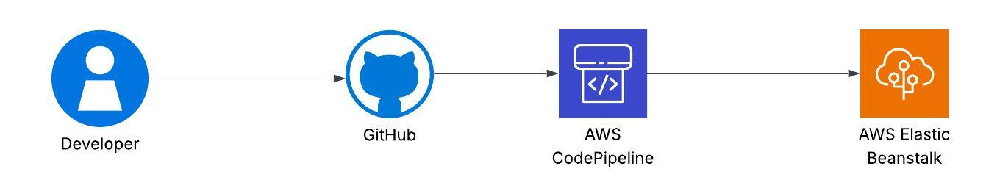

# Fast-Track CI/CD Pipeline Automation with GitHub, AWS CodePipeline & Elastic Beanstalk

Automate your deployments in minutes! This guide walks you through building a fully automated CI/CD pipeline for a sample Node.js application using:

- **GitHub** – For version control and source code management
- **AWS CodePipeline** – For automating the build and deployment process
- **AWS Elastic Beanstalk** – For scalable, managed hosting with zero infrastructure setup

---

## Tools & Technologies

- GitHub
- AWS CodePipeline
- AWS Elastic Beanstalk
- (Optional) AWS CodeBuild
- (Optional) Amazon RDS
- (Optional) Amazon Route 53 for domain management

---

## Project Structure

```
root-directory/
├── .ebextensions/
├── .elasticbeanstalk/config.yml
├── app.js
├── package.json
└── README.md
```

---

## Step-by-Step Deployment Guide

### Step 1: Prepare Your Node.js Application

Create a simple Node.js app with the following structure:

```js
// app.js
const express = require('express');
const app = express();

app.get('/', (req, res) => res.send('Hello from AWS CI/CD!'));

const PORT = process.env.PORT || 3000;
app.listen(PORT, () => console.log(`Server running on port ${PORT}`));
```

Add a `package.json`:
```json
{
  "name": "ci-cd-demo",
  "version": "1.0.0",
  "main": "app.js",
  "dependencies": {
    "express": "^4.17.1"
  },
  "scripts": {
    "start": "node app.js"
  }
}
```

---

### Step 2: Push Code to GitHub

1. Initialize Git and commit your project:

```bash
git init
git add .
git commit -m "Initial commit"
```

2. Create a new repo on GitHub and push:

```bash
git remote add origin https://github.com/YourUsername/your-repo.git
git push -u origin main
```

---

### Step 3: Deploy to AWS Elastic Beanstalk

1. Install the EB CLI and configure:
```bash
pip install awsebcli
eb init -p node.js your-app-name
```

2. Create an environment:
```bash
eb create your-env-name
```

3. Open the app in your browser:
```bash
eb open
```

Elastic Beanstalk will handle:
- Auto-scaling
- Load balancing
- Health checks
- Deployment rollback

---

### Step 4: Create CI/CD Pipeline with AWS CodePipeline

1. Go to **AWS Console → CodePipeline → Create Pipeline**
2. **Source Stage**: Choose GitHub and connect your repo
3. **Deploy Stage**: Select **Elastic Beanstalk** as your deployment provider
4. Review and create the pipeline

Now, each push to GitHub will automatically trigger a deployment.

---

## Optional Enhancements

### Add AWS CodeBuild (for testing before deploy)
- Insert CodeBuild as a stage between source and deploy
- Define a `buildspec.yml` for test/build logic

### Use Amazon RDS for Database
- Provision RDS (PostgreSQL, MySQL, etc.)
- Add connection logic in your app via environment variables

### Set up a Custom Domain with Route 53
- Map your Elastic Beanstalk environment CNAME to a Route 53 hosted zone

---

## Architecture Diagram




---

## Why You Should Try This

-  **Zero Manual Deployments** – Just push code to GitHub
-  **Auto Scaling & Load Balancing** – AWS handles it
-  **Cost-Effective for Startups** – Only pay for what you use
-  **Peace of Mind** – Auto rollback and monitoring built in

---

##  Final Result

Every time you push to GitHub, CodePipeline deploys the latest version to Elastic Beanstalk automatically.

---


**License:** MIT


---

